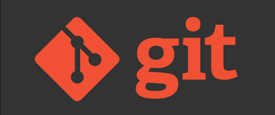
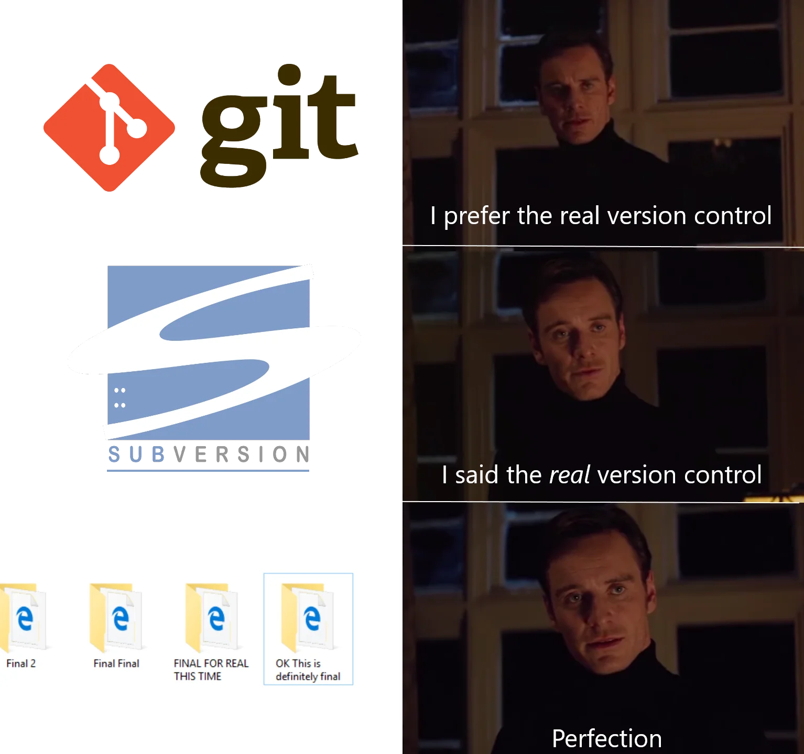
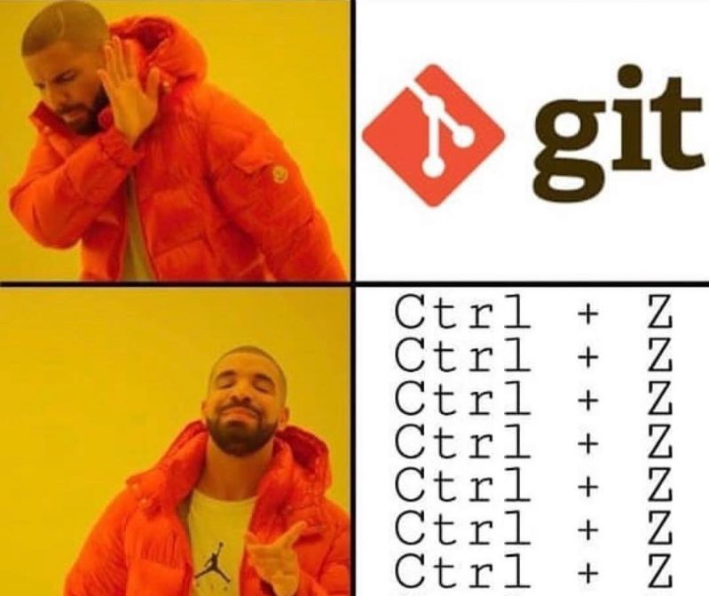
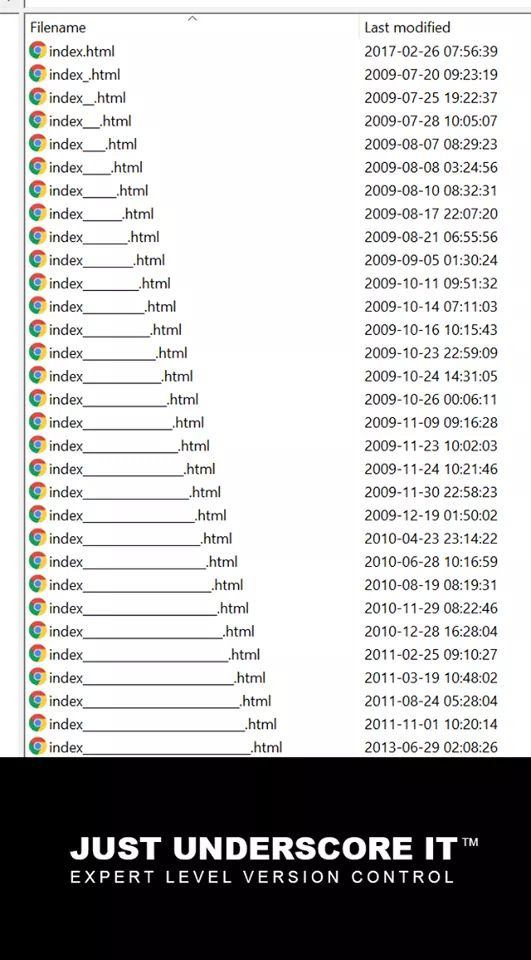
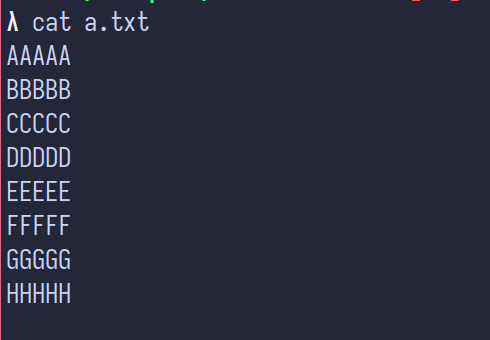
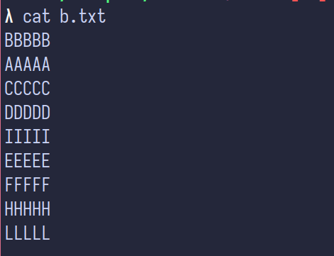
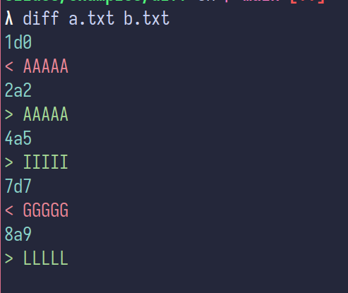

### Git workshop 

 

Ljubljana FRI, December 2023

---
### Kdo smo <!-- .element: style="text-align: left; font-size: 50px;" -->
<style>
.container{
    display: flex;
}
.col{
    flex: 1;
}
</style>

<div class="container">

<div class="col">

<div style="display: flex; align-items: center;"><b>DragonSec SI</b> </div>
<div style="display: flex; align-items: center;"><b>@DragonSec_SI</b> </div>
<div style="display: flex; align-items: center;"><b>info@dragonsec.si</b> </div>


</div>
<!-- .element: style="width: 100%;" -->

<div class="col">

 

</div>

---
### GIT

Kaj sploh je git?



Note: Predstavljaj si, da gradiš stolp iz lego kock. Vsakič, ko dodaš novo kocko, stolp postane malo višji. 
Včasih pa morda dodaš kocko, ki ti ne ustreza ali pa celo zruši stolp. Kako bi bilo super, če bi lahko shranil, kako je stolp izgledal na vsaki stopnji, 
tako da bi se lahko vedno vrnil nazaj, če nekaj ne bi delovalo, kajne?

Git je kot čarobna škatla za shranjevanje vsake faze tvojega lego stolpa. 
Vsakič, ko dodaš pomembne kocke (ali spremembe) na svoj stolp (ki je tukaj tvoj projekt ali delo), lahko "shraniš" kako izgleda. 
To imenujemo "commit". Če kasneje nekaj gre narobe, lahko uporabiš Git, da se vrneš nazaj do ene od teh shranjenih točk, kjer je bilo vse v redu.

Poleg tega, če imaš prijatelje, ki ti pomagajo graditi stolp, lahko Git pokaže, kdo je dodal katere kocke in kdaj. 
To pomaga, da vsi vedo, kaj se dogaja z stolpom in kako raste.

Torej, Git je kot čarobna škatla, ki ti pomaga shraniti vsak korak pri gradnji tvojega lego projekta, 
in ti omogoča, da se vrneš nazaj, če nekaj gre narobe ali če želiš videti, kako je projekt izgledal v preteklosti.


---
### GIT vs. GITHUB


Note: Git je sistem za nadzor različic, ki lokalno sledi spremembam v datotekah, običajno v kontekstu razvoja programske opreme. 
Omogoča razvijalcem, da ustvarijo "commits" ali zapiske o spremembah, ki so jih naredili v svojih datotekah. 
Prav tako omogoča povrnitev datotek na prejšnje stanje in ogled zgodovine, kdo je kdaj naredil kakšno spremembo. 
Git je orodje, ki se uporablja na lokalnem računalniku in je neodvisno od interneta ali centraliziranega strežnika.

GitHub pa je spletna platforma, ki gosti Git skladišča in dodaja funkcije za sodelovanje, kot so upravljanje nalog, 
zahteve za prevzem (pull requests), in pregledovanje kode. GitHub je kot socialno omrežje za razvijalce, 
kjer lahko shranjujejo svoje projekte (skladišča), sodelujejo z drugimi in delijo svojo kodo z javnostjo ali v privatnih skupinah. 
GitHub deluje v oblaku in je dostopen preko spleta.

Ključna razlika je torej ta, da je Git orodje, ki deluje lokalno in omogoča nadzor različic, 
medtem ko je GitHub spletna storitev, ki gradi na Gitu in dodaja funkcionalnosti za sodelovanje in gostovanje kode.

---
### Zakaj bi uporabljali Git?



Note:

Git je napreden sistem za nadzor različic, ki omogoča razvijalcem učinkovito sledenje in upravljanje sprememb v kodi. 
V primerjavi z ročnim shranjevanjem različnih verzij v ločenih direktorijih, Git ponuja boljšo organizacijo, 
varčuje s prostorom z inteligentnim shranjevanjem sprememb, olajša združevanje sprememb iz različnih vej (branches) 
in omogoča enostavno povrnitev na prejšnje verzije

Medtem pa ce shranjujemo različne verzije v ločenih direktorijih, se lahko zgodi, da se izgubijo ali pa jih je težko najti.


---



---



---
#### Kaj je Diff?

<style>
.container {
    display: flex;
    flex-wrap: wrap;
}
.col {
    flex: 50%; /* each column will take up half of the container width */
}
.full-width {
    width: 100%;
}
</style>

<div class="container">
   <div class="col">
   .
    
   </div>

   <div class="col">
   .
    
   </div>

   <div class="full-width">
     
   </div>
</div>

Note:
V kontekstu Git-a in razvoja programske opreme, "diff" je kratka oblika za "difference" (razlika). 
To orodje se uporablja za prikaz razlik med dvema datotekama ali nizoma datotek. 
Pogosto se uporablja za prikaz sprememb, ki so bile narejene v datoteki ali med različnimi verzijami datoteke v sistemu za nadzor različic, kot je Git.

Ko uporabljate Git, lahko z ukazom git diff vidite, 
kaj se je spremenilo v datotekah, ki še niso bile "committed" (to je, katerih spremembe še niso bile uradno zabeležene v Git zgodovini). 
Ta ukaz prikaže vrstice, ki so bile dodane, spremenjene ali odstranjene. 

1d0 - izbrisi vrstico 1 iz datoteke A
2a2 - dodaj vrstico 2 iz datoteke B na mesto 2 v datoteki A
4a5 - dodaj vrstico 4 iz datoteke B na mesto 5 v datoteki A
7d7 - izbrisi vrstico 7 iz datoteke A
8a9 - dodaj vrstico 8 iz datoteke B na mesto 9 v datoteki A

Basically recept kako priti iz datoteke A v datoteko B.

---
### Kako začeti z Gitom?

```bash
git init
```

```bash
λ ls -lah
drwxr-xr-x spagnologasper users 4.0 KB ... 2023 .
drwxr-xr-x spagnologasper users 4.0 KB ... 2023 ..
drwxr-xr-x spagnologasper users 4.0 KB ... 2023 .git
```

Note: Zacnemo z git init, tako ustvarimo nas lokalni repozitorij.

---
### Kaj se ustvari ob git init?

```
λ ls -lah .git
drwxr-xr-x spagnologasper users 4.0 KB ...  .
drwxr-xr-x spagnologasper users 4.0 KB ...  ..
drwxr-xr-x spagnologasper users 4.0 KB ...  branches
.rw-r--r-- spagnologasper users  92 B  ...  config
.rw-r--r-- spagnologasper users  73 B  ...  description
.rw-r--r-- spagnologasper users  23 B  ...  HEAD
drwxr-xr-x spagnologasper users 4.0 KB ...  hooks
drwxr-xr-x spagnologasper users 4.0 KB ...  info
drwxr-xr-x spagnologasper users 4.0 KB ...  objects
drwxr-xr-x spagnologasper users 4.0 KB ...  refs
```

---
### Config 

 To je datoteka konfiguracije za vaš Git repozitorij. 
 V njej so shranjene lokalne nastavitve za vaš repozitorij, 
 kot so informacije o uporabniku (ime in e-pošta), oddaljeni repozitoriji (remote repositories), 
 veje (branches), in druge nastavitve, specifične za vaš projekt.
 V to datoteko tudi pisejo git ukazi, ki jih izvajamo.

 ```
[core]
	repositoryformatversion = 0
	filemode = true
	bare = false
	logallrefupdates = true
 ```


---
### Description

Vsebuje opis samega repozitorija.

```
λ cat description
Unnamed repository; 
edit this file 'description' to name the repository.
```

---
### HEAD
Datoteka HEAD vsebuje referenco na trenutno izbrano vejo. Pogosto kaže na datoteko znotraj refs/heads map

```
λ cat HEAD
ref: refs/heads/master
```

---
### OBJECTS
Direktorij objects je ključna komponenta Gitovega shranjevanja. 
Vsebuje vse podatkovne objekte (commits, drevesa, binarne datoteke), 
ki predstavljajo vsebino vašega repozitorija. Ti objekti so shranjeni v stisnjeni in binarni obliki

---
### REFS
V tem direktoriju so shranjene reference na veje (branches), oznake (tags) 
in oddaljene repozitorije (remotes). Vsaka od teh poddirektorijev vsebuje datoteke, 
ki kažejo na določene commite.

---
### LOGS
Direktorij logs vsebuje dnevniške datoteke, 
ki zapisujejo spremembe v različnih referencah, kot so veje. 
To omogoča sledenje zgodovini sprememb.

---
### HOOKS
Direktorij `hooks` vsebuje skripte, ki se lahko samodejno izvajajo ob določenih dogodkih v Git ciklu, 
kot je commit, push, in podobno. Privzeto so te skripte vzorci in niso aktivne.

---
### Kako dodamo oddaljeni repozitorij?

Recimo, da sedaj zelimo nas lokalni git povezati z nekim git streznikom, da bomo imeli backup nasega lokalnega repozitorija.

```bash
git remote add origin https://gitea.spanskiduh.dev/spanskiduh/test-repo.git
```

V datoteko `.git/config` se doda vrstica:
```
[remote "origin"]
        url = https://gitea.spanskiduh.dev/spanskiduh/test-repo.git
        fetch = +refs/heads/*:refs/remotes/origin/*
```


---
### Hvala za pozornost <!-- .element: style="text-align: left; font-size: 50px;" -->
<style>
.container{
    display: flex;
}
.col{
    flex: 1;
}
</style>

<div class="container">
<div class="col">

<div style="display: flex; align-items: center;"><b>DragonSec SI</b> </div>
<div style="display: flex; align-items: center;"><b>@DragonSec_SI</b> </div>
<div style="display: flex; align-items: center;"><b>info@dragonsec.si</b> </div>


</div>
<!-- .element: style="width: 100%;" -->

<div class="col">

 

</div>
</div>
